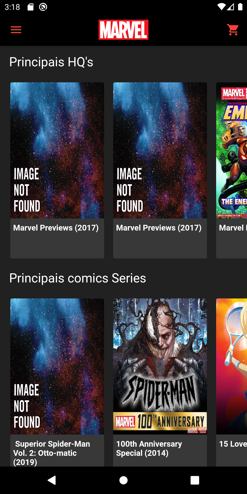
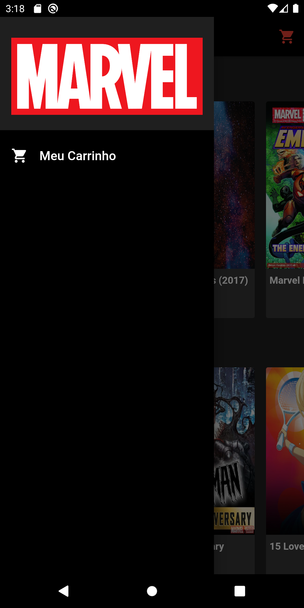
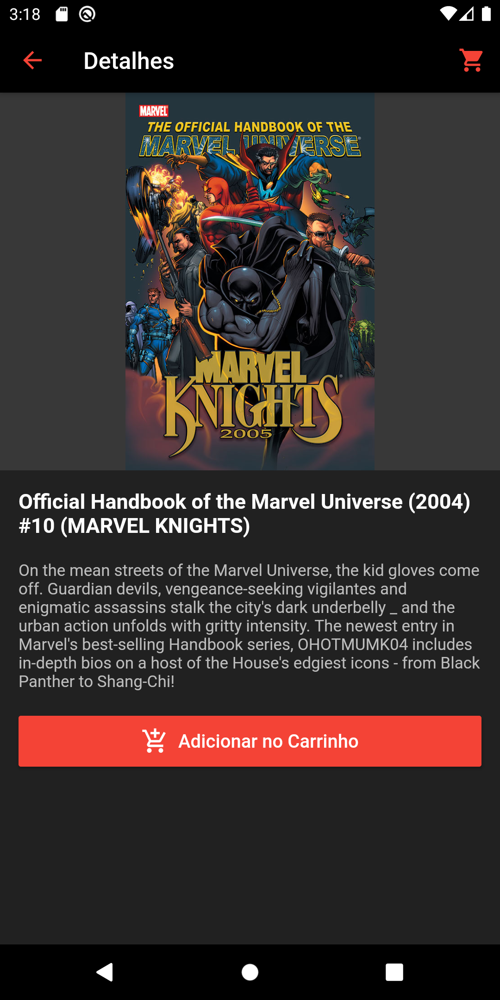
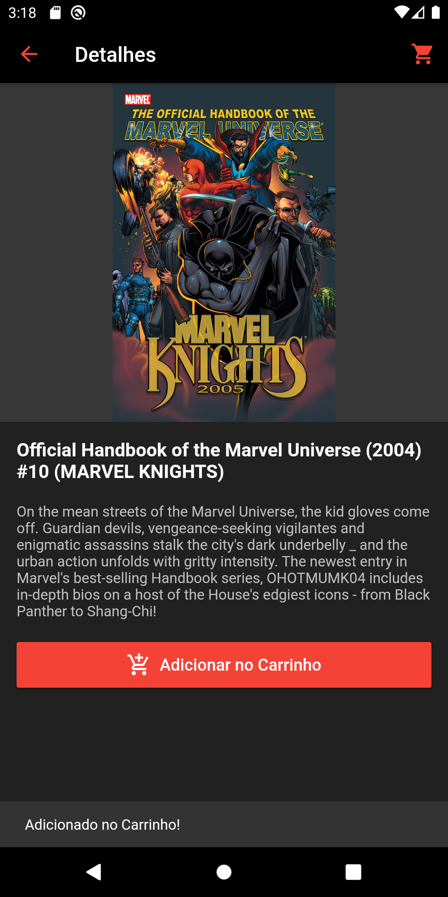
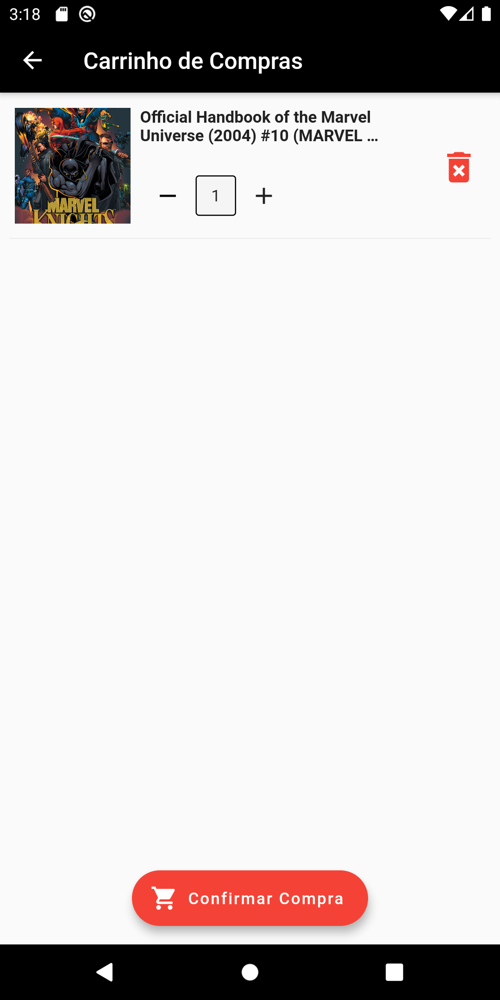

# MARVEL HQ

Um projeto utilizando a API da MARVEL com Flutter.
API: https://developer.marvel.com (faça seu cadatro para obter as chaves de consumo da API)

## Desenvolvimento

Projeto desenvolvido em **Flutter**, utilizando:

- [firebase_core](https://pub.dev/packages/firebase_core)
- [cloud_firestore](https://pub.dev/packages/cloud_firestore)
- [http](https://pub.dev/packages/http)
- [crypto](https://pub.dev/packages/crypto)

## Desenvolvimento

Projeto desenvolvido em **Flutter**, utilizando:

- [firebase_core](https://pub.dev/packages/firebase_core)
- [cloud_firestore](https://pub.dev/packages/cloud_firestore)
- [http](https://pub.dev/packages/http)
- [mask_text_input_formatter](https://pub.dev/packages/mask_text_input_formatter)

## Demonstração

### Home

### Drawer

### Detalhes

### Adicionar no Carrinho

### Carrinho de Compras

## Copyright E Licença

Copyright 2021 Johnny Freire.

